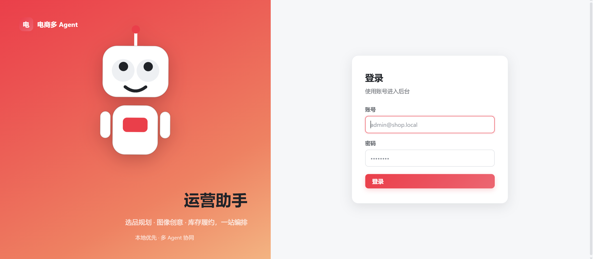
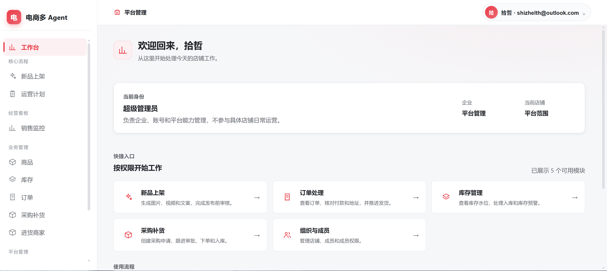
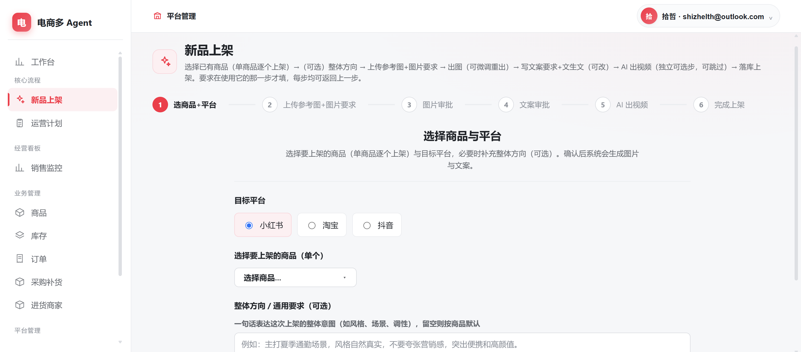

# 电商多 Agent 运营助手

一个面向多企业、多店铺电商团队的运营后台，覆盖**内容生产、平台发布前审核、订单履约、库存管理、采购补货和权限隔离**。

项目的核心目标不是让 Agent 自由聊天，而是把模型能力放进可控的业务流程中：

> **业务状态由代码和数据库负责，Agent 负责理解、生成、分析和建议；关键节点必须经过权限校验、人工确认、审计和可恢复处理。**

当前项目已经完成内部业务骨架和两条主业务线的本地闭环。小红书、淘宝、抖音的官方 OAuth、字段映射和商家联调仍是接入生产前的主要工作。

## 项目亮点

- **固定 Workflow + 多 Agent**：使用确定性的业务流程串联多个专业 Agent，而不是让模型直接决定订单或库存状态。
- **Java / Python 分层**：Java 负责业务规则、权限、事务和落库；Python 负责 Agent 编排、模型调用和结构化输出。
- **真实结果优先**：模型或平台凭证缺失时明确报错，不伪造文案、图片、视频或平台成功结果。
- **多租户隔离**：企业、店铺、成员、权限、商品、订单、库存、采购和平台凭证按租户上下文隔离。
- **可审计、可恢复**：关键状态变化记录审计；平台任务支持幂等、重试、失败闭合和人工对账。
- **API 可替换**：平台能力通过统一适配器接入，接入真实开放平台时不需要重写 Java 业务状态机。

## 产品界面

### 登录入口

系统使用账号登录，不在页面展示默认账号或密码。



### 角色化工作台

登录后进入工作台，页面根据超级管理员、企业老板或普通员工的身份和权限展示可用入口。



### 新品上架流程

新品上架按步骤组织平台选择、内容要求、图片审核、文案审核、视频生成和最终发布。



## 功能总览

### 线 1：内容生产与发布

```text
选择企业 / 店铺 / 商品 / 平台
        ↓
填写 Content Brief 和图片、视频、文案要求
        ↓
图片生成（可选）→ 视频生成（可引用已确认图片）→ 文案生成
        ↓
各平台独立审核
        ↓
运营计划审核
        ↓
平台发布任务
```

支持小红书、淘宝、抖音同时生成内容。不同平台的内容相互独立，不会因为某个平台失败而伪造其他平台成功。

当前已具备：

- Content Brief 以及图片、视频、文案分项要求
- 图片、视频、文案生成门控
- 图片作为视频素材的关联关系
- 人工审核、驳回和重新生成
- 发布适配器、幂等键、并发认领、失败重试、超时识别和人工对账

待完成：小红书、淘宝、抖音官方 OAuth、真实发布请求字段映射、限流处理和商家账号联调。

### 线 2：订单履约与库存补货

```text
平台订单 → 付款 / 地址 / 库存检查 → 库存预留与并发扣减
       → 仓库发货 → 物流信息 → 售后和审计

进货商家 → 采购申请 → 审批 → 已下单 → 待入库
       → 分批收货 → 已入库 / 短收关闭
```

当前已具备：

- 未付款、地址不全、库存不足和人工复核闭环
- 订单库存预留和数据库级原子扣减，避免并发超卖
- 供应商、采购申请、审批、收货、入库和采购成本记录
- 按省份配置买家运费模板，订单记录实际快递费用
- 库存流水、采购收货记录和业务审计

待完成：各平台真实订单拉取、物流回传、发货 API 和售后同步联调。

## 系统架构

```text
┌──────────────────────┐
│ React + Vite 前端     │
│ 工作台 / 业务页面 / 权限入口 │
└──────────┬───────────┘
           │ HTTP / JWT
┌──────────▼───────────┐
│ Java Spring Boot      │
│ 业务规则 / 权限 / 事务 / API │
└──────────┬───────────┘
           │ PostgreSQL
┌──────────▼───────────┐
│ PostgreSQL + Flyway   │
│ 业务数据 / 租户数据 / 审计 │
└──────────────────────┘

Java ── HTTP ──▶ Python FastAPI
                  Agent 编排 / LLM / RAG / 平台适配器
```

### Java 服务

负责企业、店铺、成员和权限，以及商品、库存、订单、采购、状态机、事务、并发控制、平台任务和审计记录。

### Python 服务

负责 Supervisor 和业务 Agent 编排、模型调用、Pydantic 结构化输出、分类知识库 RAG、平台适配器和 Agent trace。

## Agent 设计

```text
Supervisor
   ├── Product Planning Agent
   ├── Image Creative Agent
   ├── Inventory & Purchase Agent
   └── Order Fulfillment Agent

Line 2 Monitor
   ├── Inventory Monitor Agent
   └── Order Monitor Agent
```

这个设计来自对 Multi-Agent 框架的学习：

| 抽象 | 在本项目中的理解 |
| --- | --- |
| LangGraph / 状态机 | 用明确状态、节点和边控制高可靠业务流程 |
| CrewAI / 角色协作 | 每个 Agent 负责清晰的专业职责 |
| AutoGen / 专家讨论 | 适合未来放在高风险决策或质量复核节点 |
| Magnetic-One / Supervisor | 根据触发类型选择需要执行的 Agent |
| OpenAI Agents SDK | Agent 使用 Tool 获取业务上下文，不直接操作数据库 |
| AgentScope | 为未来高并发、异步任务和分布式 Agent 扩展提供参考 |

本项目的选型原则：

1. 简单任务不为了“多 Agent”而拆分。
2. 固定流程优先使用代码状态机。
3. 模型只输出结构化建议，不直接越权修改核心状态。
4. 人工审核、数据库事务和审计必须在 Agent 之外保留。

## 用户与企业体系

```text
超级管理员 → 创建企业并指定企业老板
                    ↓
             企业老板创建多个店铺
                    ↓
             员工加入一个或多个店铺
                    ↓
             老板按权限多选分配能力
```

- 超级管理员：管理企业、平台级账号和平台模拟。
- 企业老板：管理店铺、成员、权限、模型设置、平台凭证和业务数据。
- 普通员工：只能使用当前店铺中被分配的权限。
- 登录后进入角色化工作台，快捷入口根据权限动态展示。
- “组织与成员”属于企业级管理，放在右上角账号菜单；店铺经营功能放在左侧导航。
- 平台凭证按店铺隔离，模型设置按企业维护。

## 当前完成度

### 已完成

- React + Vite 前端工作台和权限导航
- Java Spring Boot 业务服务
- Python FastAPI 多 Agent 服务
- PostgreSQL + Flyway 数据落库
- 企业、店铺、成员、权限和多租户隔离
- 内容生成、审核和发布前门控
- 订单履约、库存并发控制和采购补货闭环
- 运费模板和订单实际快递费用
- Agent trace、平台任务、库存流水和业务审计
- Docker Compose 本地全栈运行


## 快速开始

### Docker Compose

```bash
cp .env.example .env
docker compose up -d --build
```

启动后访问：

- 前端：<http://localhost>
- Java 健康检查：<http://localhost/health>
- Python 健康检查：<http://localhost:8000/health>

不要把真实 API Key、数据库密码或 JWT 密钥提交到 Git。首次部署后请由系统管理员创建和维护账号。

### 本地开发启动

```bash
# 1. PostgreSQL
docker compose up -d postgres

# 2. Java
cd java-service
mvn spring-boot:run

# 3. Python
cd ../python-agent-service
uv sync
uv run fastapi dev app/main.py --host 0.0.0.0 --port 8000

# 4. 前端
cd ../frontend
npm install
npm run dev
```

开发地址：<http://localhost:5173>

## 主要目录

```text
.
├── frontend/                 # React + Vite 前端
├── java-service/             # Spring Boot 业务服务
├── python-agent-service/     # FastAPI Agent 服务
├── scripts/                  # 端到端验证和辅助脚本
├── docs/                     # 系统手册、计划和生产检查清单
├── docker-compose.yml        # PostgreSQL、Java、Python、前端
├── .env.example              # 环境变量示例，不含真实密钥
└── .gitignore                # 本地数据、日志、构建产物和密钥排除规则
```

## 验证

```bash
cd frontend && npm run build
cd ../java-service && mvn test
cd ../python-agent-service && uv run pytest
```

更多当前状态和详细业务流程见：[系统现状与用户使用手册](docs/SYSTEM_STATUS_AND_USER_GUIDE.md)。

## License

当前项目用于学习、研发和作品展示。正式开源前请根据实际依赖和商业计划补充 License。
