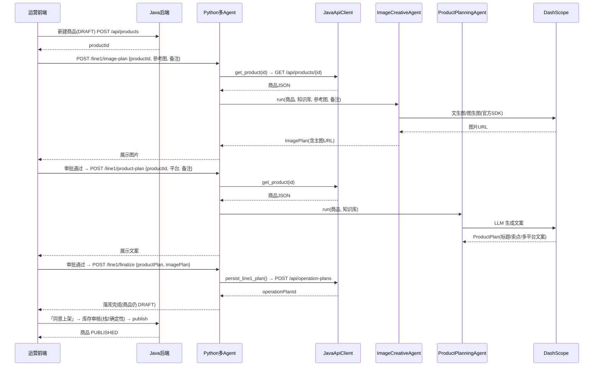
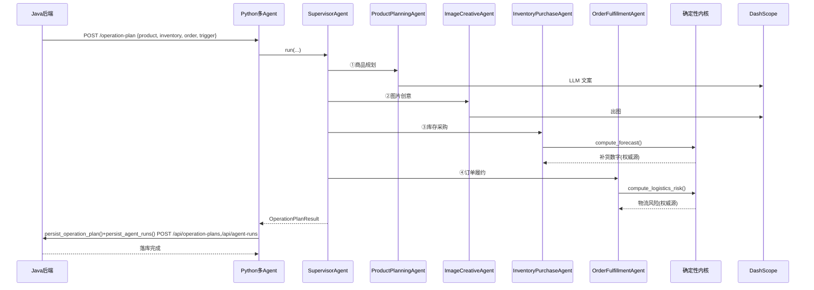
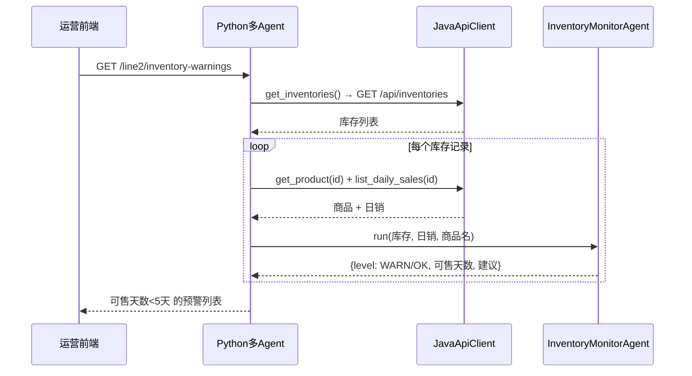

# 电商多 Agent 助手 · 架构说明与时序图

> 用途：向团队/外人讲清这个项目"是什么、有哪些 Agent、数据怎么在 Java / Python / 模型之间流动、以及没配大模型时还能干多少"。
> 内容基于代码实际结构（`app/agents/`、`app/api/`、`app/tools/java_api_client.py`），非设想。

---

## 1. 项目定位

一个**电商商家运营助手**：把"上架一个商品 → 写文案/出图 → 算补货 → 判履约"这条运营主线用多 Agent 自动化。

三层分工：

| 层 | 技术 | 职责 |
|---|---|---|
| 前端 | React / Vite | 运营操作界面：设置中心、上架流程、销售监控页 |
| 传统后端 | Java Spring Boot | 商品/订单/库存 CRUD、发布审核、**唯一数据源（落库）** |
| 智能层 | Python 多 Agent 服务（FastAPI） | LLM 编排、出图/视频、确定性预测 |

**Java ↔ Python 边界**：两者走 HTTP/JSON。
- Java 调 Python：REST 调 Python 的 `/agent/ecommerce/*` 端点。
- Python 调 Java：经 `JavaApiClient`（携带 `X-Service-Key` 鉴权）反查商品/订单/库存、并把运营计划写回落库。
- **Python 不直接连业务库**，结果一律回传 Java 落库。

---

## 2. Agent 全景（共 6 个 Agent 类）

严格说 `app/agents/` 下有 6 个 Agent 类，分两类：

### A. 主链路编排者（1 个）
- **`SupervisorAgent`**（`supervisor_agent.py`）——调度中枢。按 `trigger_type` 动态路由，依次跑 `product → image → inventory → fulfillment`；`INVENTORY_VIEW` 触发时只跑后两个。带 trace / 重试，失败如实上报（不静默降级）。

### B. 业务 Agent（5 个，真正干活）

| Agent | 文件 | 职责 | 所属线 |
|---|---|---|---|
| `ProductPlanningAgent` | `product_planning_agent.py` | 商品规划：标题/卖点/详情/SEO/三平台（淘宝·抖音·小红书）文案，可注入分类知识库 | 线1 上架 |
| `ImageCreativeAgent` | `image_creative_agent.py` | 图片创意：主图文生图/图生图提示词 + 风格 + 合规审核 | 线1 上架 |
| `InventoryPurchaseAgent` | `inventory_purchase_agent.py` | 库存与采购：补货建议/优先级，数字由确定性内核算，LLM 只补说明 | 线1 上架 |
| `OrderFulfillmentAgent` | `order_fulfillment_agent.py` | 订单履约：发货判定/物流风险/人工确认建议 | 线1 上架 |
| `InventoryMonitorAgent` | `inventory_monitor_agent.py` | 库存监控：真实日销 + 大促日历估"可售天数"，<5 天预警（销售监控页） | 线2 监控 |

### C. 两个"确定性内核"模块（不是 Agent，是被 Agent 调用的"脑"）
- `forecast.py`（`compute_forecast`）→ 被 `InventoryPurchaseAgent` 用，纯统计算需求/补货量。
- `logistics.py`（`compute_logistics_risk`）→ 被 `OrderFulfillmentAgent` 用，启发式算物流风险。

**关键设计模式：确定性内核 + LLM 接线。**
预测数字、物流风险这些"不能瞎编"的结论，由 `forecast.py` / `logistics.py` 确定性算出（权威源）；LLM 只负责把结论翻成可读文案；最后用确定性结论**覆盖** LLM 可能臆造的字段，保证落库与 trace 一致。因此主链路"大框架、小闭环"能成立：智能决策可降级到规则（无 Key 时走 `_rule_based_run`），但数字永远来自确定性内核，不会乱。

---

## 3. 是否都依赖"配置的大模型"？

先厘清：**"大模型配置"其实是两张独立的卡**，不要混为一谈：
- **LLM 卡片**（文本大模型，如 `qwen3.7-plus`）——管"写文案 / 写提示词"。
- **图片卡片**（出图模型 `qwen-image`）——管"真实出图"，是**另一个独立模型**，跟文本 LLM 无关。

| Agent | 用文本 LLM？ | 没文本 LLM 时 | 用图片模型？ |
|---|---|---|---|
| `SupervisorAgent` | 否（只编排） | 正常 | 否 |
| `ProductPlanningAgent` | 是（写文案） | 降级为规则模板 | 否 |
| `ImageCreativeAgent` | 是（写提示词/审核） | 降级为通用提示词 | **是**，真实出图独立于 LLM |
| `InventoryPurchaseAgent` | 是（补原因说明） | 降级；**补货数字仍由确定性内核给** | 否 |
| `OrderFulfillmentAgent` | 是（补履约建议） | 降级；**风险仍由确定性内核给** | 否 |
| `InventoryMonitorAgent` | 否（纯确定性） | 正常 | 否 |

要点：`InventoryPurchaseAgent` / `OrderFulfillmentAgent` / `InventoryMonitorAgent` 的**决策数字**来自 `forecast.py` / `logistics.py`，是**纯 Python 计算，根本不调任何模型**。文本 LLM 只补"人话"。而 `ImageCreativeAgent` 的**真实出图只认图片卡片 Key**，与文本 LLM 无关。

---

## 4. 如果没配置大模型，能做到什么程度？

**A. 只没配文本 LLM，但图片 Key 配了**
- 文案/标题/SEO → 规则模板（能出，但生硬，多平台文案退化成通用话术）
- 图片 → **仍能真实出图**（用规则提示词当输入喂给 qwen-image）
- 库存 / 履约 / 监控 → **完全正常**（确定性，零模型依赖）

**B. 啥模型都没配（只有 Java + Python 规则层）**
- 库存补货建议、履约物流风险、库存监控预警 → **仍完全正常**（纯 `forecast.py` / `logistics.py` 计算，不需要任何 Key）
- 文案 → 只剩模板占位
- 图片 → 出不了（必须图片卡片 Key）
- 上架编排、落库、发布闸门 → 正常

**C. 全配齐（推荐）** → 智能文案 + 真实出图 + 全决策，闭环完整。

> 一句话：这项目把"不能瞎编"的硬决策（补多少货、能不能发货、几天售罄）用确定性代码兜底，大模型只负责"写得更像人话 / 更有创意"这一层——断网或没配 Key，业务不崩，只是变朴素。

---

## 5. 时序图

### 图1 · 线1 上架流水线（分步门控，前端驱动）
> 这条线**前端直接调 Python**，Python 再**反向拉** Java（`get_product`）取真实商品喂 Agent。

### 图2 · 线1 主链路 / operation-plan（Supervisor 一次性跑 4 Agent）
> 这条线与图1**相反**——Java 把 product/inventory/order **整包推**进请求体，Python 不再反向拉。

### 图3 · 线2 库存监控（InventoryMonitorAgent）

---

## 6. 关键边界（讲的时候必说三点）

1. **两个调用方向相反的入口**：线1（上架）是"前端 → Python，Python 拉 Java"；operation-plan 是"Java 推数据进 Python"。不要混为一谈。
2. **Python 不碰数据库**：所有落库都通过 `JavaApiClient` 写回 Java（`X-Service-Key` 鉴权），Java 才是唯一数据源。Python 挂了，Java 业务照常跑。
3. **确定性内核是"脑"**：`InventoryPurchaseAgent` / `OrderFulfillmentAgent` 的决策数字来自 `forecast.py` / `logistics.py`，LLM 只补文案——所以"不联网也能出合理结论，联网只是更会说人话"。
