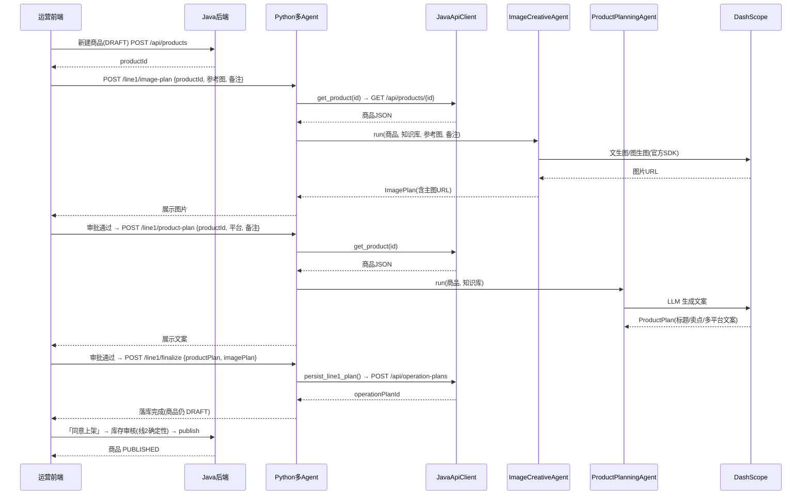
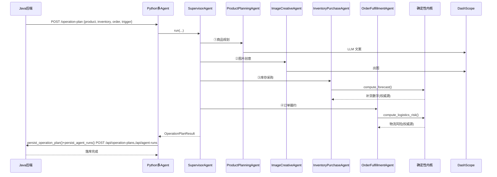
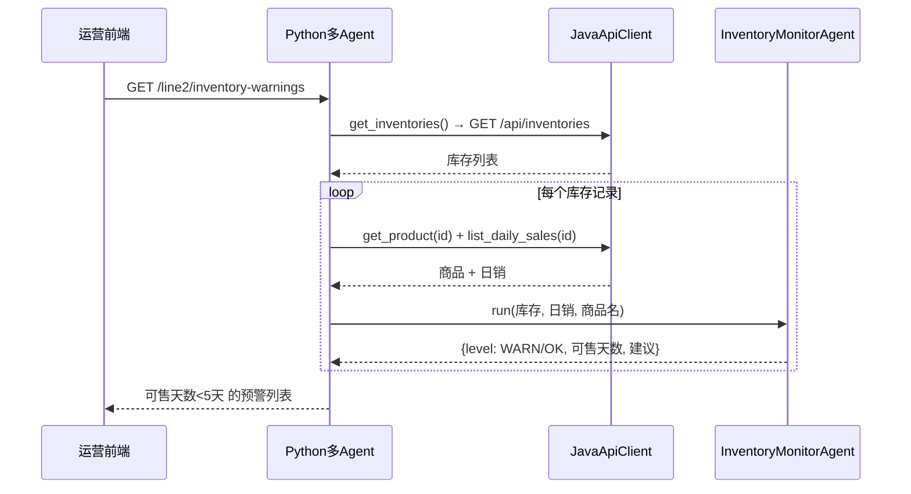
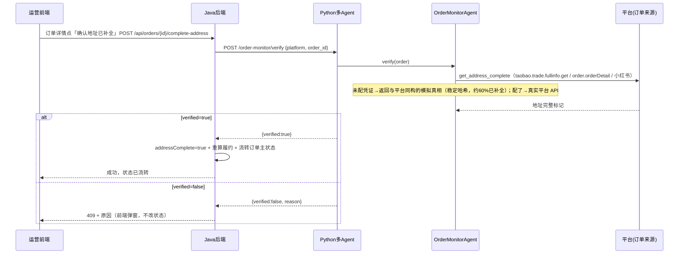
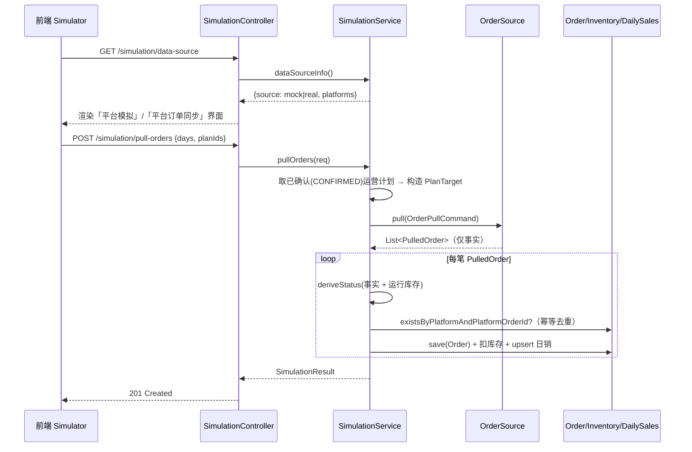
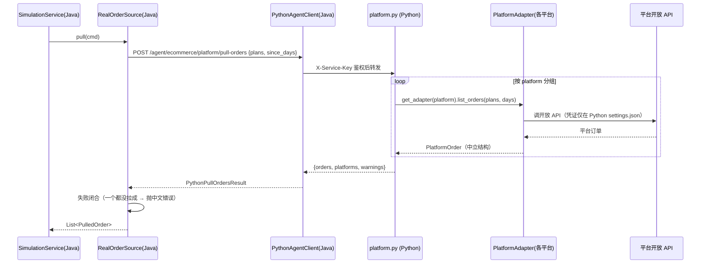

# 电商多 Agent 助手 · 架构说明与时序图

> 用途：向团队/外人讲清这个项目"是什么、有哪些 Agent、数据怎么在 Java / Python / 模型之间流动、以及没配大模型时还能干多少"。
> 内容基于代码实际结构（`app/agents/`、`app/api/`、`app/tools/java_api_client.py`），非设想。

---

## 1. 项目定位

一个**电商商家运营助手**：把"上架一个商品 → 写文案/出图 → 算补货 → 判履约"这条运营主线用多 Agent 自动化。

三层分工：

| 层 | 技术 | 职责 |
|---|---|---|
| 前端 | React / Vite | 运营操作界面：设置中心、上架流程、销售监控页 |
| 传统后端 | Java Spring Boot | 商品/订单/库存 CRUD、发布审核、**唯一数据源（落库）** |
| 智能层 | Python 多 Agent 服务（FastAPI） | LLM 编排、出图/视频、确定性预测 |

**Java ↔ Python 边界**：两者走 HTTP/JSON。
- Java 调 Python：REST 调 Python 的 `/agent/ecommerce/*` 端点。
- Python 调 Java：经 `JavaApiClient`（携带 `X-Service-Key` 鉴权）反查商品/订单/库存、并把运营计划写回落库。
- **Python 不直接连业务库**，结果一律回传 Java 落库。

---

## 2. Agent 全景（共 7 个 Agent 类）

严格说 `app/agents/` 下有 7 个 Agent 类，分三类：

### A. 主链路编排者（1 个）
- **`SupervisorAgent`**（`supervisor_agent.py`）——调度中枢。按 `trigger_type` 动态路由，依次跑 `product → image → inventory → fulfillment`；`INVENTORY_VIEW` 触发时只跑后两个。带 trace / 重试，失败如实上报（不静默降级）。

### B. 业务 Agent（4 个，主链路真正干活）

| Agent | 文件 | 职责 | 所属线 |
|---|---|---|---|
| `ProductPlanningAgent` | `product_planning_agent.py` | 商品规划：标题/卖点/详情/SEO/三平台（淘宝·抖音·小红书）文案，可注入分类知识库 | 线1 上架 |
| `ImageCreativeAgent` | `image_creative_agent.py` | 图片创意：主图文生图/图生图提示词 + 风格 + 合规审核 | 线1 上架 |
| `InventoryPurchaseAgent` | `inventory_purchase_agent.py` | 库存与采购：补货建议/优先级，数字由确定性内核算，LLM 只补说明 | 线1 上架 |
| `OrderFulfillmentAgent` | `order_fulfillment_agent.py` | 订单履约：发货判定/物流风险/人工确认建议 | 线1 上架 |

### C. 监控 Agent（2 个，线2 独立运行，不在 operation-plan 主链路内）

| Agent | 文件 | 类型 | 职责 | 所属线 |
|---|---|---|---|---|
| `InventoryMonitorAgent` | `inventory_monitor_agent.py` | 预测型 | 库存监控：真实日销 + 大促日历估"可售天数"，<5 天预警（销售监控页）；可选 LLM 判未来事件 | 线2 监控 |
| `OrderMonitorAgent` | `order_monitor_agent.py` | 核验型 | 订单维度复核（当前为地址补全复核）：商家点"确认地址已补全"后，先向订单来源复核地址是否真已补全，再决定能否流转状态；非 LLM，经 `PlatformAdapter.get_address_complete` 复核，**模式无关**（模拟器 = 官方 API 替身，填凭证即查真实 API），与定时轮询共用同一接缝，不分成 real/模拟两套 | 线2 监控 |

### D. 两个"确定性内核"模块（不是 Agent，是被 Agent 调用的"脑"）
- `forecast.py`（`compute_forecast`）→ 被 `InventoryPurchaseAgent` 用，纯统计算需求/补货量。
- `logistics.py`（`compute_logistics_risk`）→ 被 `OrderFulfillmentAgent` 用，启发式算物流风险。

**关键设计模式：确定性内核 + LLM 接线。**
预测数字、物流风险这些"不能瞎编"的结论，由 `forecast.py` / `logistics.py` 确定性算出（权威源）；LLM 只负责把结论翻成可读文案；最后用确定性结论**覆盖** LLM 可能臆造的字段，保证落库与 trace 一致。因此主链路"大框架、小闭环"能成立：智能决策可降级到规则（无 Key 时走 `_rule_based_run`），但数字永远来自确定性内核，不会乱。

---

## 3. 是否都依赖"配置的大模型"？

先厘清：**设置中心是四张模型卡 + 两张独立非 LLM 卡**，不要混为一谈：
- **LLM 卡片**（文本大模型，如 `qwen3.7-plus`）——管"写文案 / 写提示词"。
- **图片卡片**（出图模型 `qwen-image`）——管"真实出图"，是**另一个独立模型**，跟文本 LLM 无关。
- **视频卡片**（如万相 `wan2.7-t2v`）——管"真实出视频"，独立模型。
- **监控卡片**（库存监控大模型）——管线2 库存智能预警；关闭/未配时按可售天数红线降级，不报错。
- **订单监控（地址复核）卡片**——**非 LLM**：经 `PlatformAdapter.get_address_complete` 复核地址是否补全，**模式无关**（未配凭证→模拟真相；配了→真实平台 API，零代码改动）。手动「确认地址已补全」与定时轮询已合并到同一条接缝，不再有 `mode`/演示通过率配置。
- **平台对接（订单数据源）卡片**——**非 LLM**：各平台 `app_key` / `app_secret` / `endpoint` / 店铺 ID / 授权令牌；`simulatePull` 开关决定 `DATA_SOURCE`（模拟造数 / 真实拉单）。**平台密钥只存在此处**，Java 不持有。

| Agent | 用文本 LLM？ | 没文本 LLM 时 | 用图片模型？ |
|---|---|---|---|
| `SupervisorAgent` | 否（只编排） | 正常 | 否 |
| `ProductPlanningAgent` | 是（写文案） | 前端拦截并提示配置 Key，不生成假文案 | 否 |
| `ImageCreativeAgent` | 是（写提示词/审核） | 前端拦截并提示配置 Key，不生成假图片/假提示词 | **是**，真实出图独立于 LLM |
| `InventoryPurchaseAgent` | 是（补原因说明） | 可缺省说明；**补货数字仍由确定性内核给** | 否 |
| `OrderFulfillmentAgent` | 是（补履约建议） | 可缺省说明；**风险仍由确定性内核给** | 否 |
| `InventoryMonitorAgent` | 否（纯确定性，可选 LLM 判未来事件） | 正常（红线降级） | 否 |
| `OrderMonitorAgent` | **否（非 LLM）** | 正常（模式无关：模拟器/真实平台走同一接缝） | 否 |

要点：`InventoryPurchaseAgent` / `OrderFulfillmentAgent` 的**决策数字**来自 `forecast.py` / `logistics.py`，是**纯 Python 计算，根本不调任何模型**；`InventoryMonitorAgent` 也是纯确定性（可选 LLM 仅补"未来事件"判断）；`OrderMonitorAgent` 完全非 LLM。生成型能力（文案、图片、视频）坚持真实结果：缺对应 Key 时前端直接提示配置，不返回假数据。而 `ImageCreativeAgent` 的**真实出图只认图片卡片 Key**，与文本 LLM 无关。

---

## 4. 如果没配置大模型，能做到什么程度？

**A. 只没配文本 LLM，但图片 Key 配了**
- 文案/标题/SEO → 前端拦截并提示配置文本 LLM Key，不生成假文案
- 图片 → 若已有真实提示词/图片输入且图片 Key 已配，可真实出图；否则提示补齐所需模型配置
- 库存 / 履约 / 监控 → **完全正常**（确定性，零模型依赖）

**B. 啥模型都没配（只有 Java + Python 规则层）**
- 库存补货建议、履约物流风险、库存监控预警 → **仍完全正常**（纯 `forecast.py` / `logistics.py` 计算，不需要任何 Key）
- 文案 / 图片 / 视频 → 前端提示去设置中心配置对应 Key，不生成假内容
- 上架编排、落库、发布闸门 → 正常

**C. 全配齐（推荐）** → 智能文案 + 真实出图 + 全决策，闭环完整。

> 一句话：这项目把"不能瞎编"的硬决策（补多少货、能不能发货、几天售罄）用确定性代码兜底；而文案、图片、视频这些生成型内容必须来自真实模型能力。缺 Key 就提示配置，不伪造结果。

---

## 5. 时序图

### 图1 · 线1 上架流水线（分步门控，前端驱动）
> 这条线**前端直接调 Python**，Python 再**反向拉** Java（`get_product`）取真实商品喂 Agent。



### 图2 · 线1 主链路 / operation-plan（Supervisor 一次性跑 4 Agent）
> 这条线与图1**相反**——Java 把 product/inventory/order **整包推**进请求体，Python 不再反向拉。



### 图3 · 线2 库存监控（InventoryMonitorAgent）



### 图4 · 线2 订单复核（OrderMonitorAgent，地址补全复核）

> 地址复核统一经模式无关的 `PlatformAdapter.get_address_complete`（未配凭证→模拟真相，配了→真实平台 API，零代码改动）。手动「确认地址已补全」与定时轮询（`OrderAddressSyncScheduler`）共用同一条接缝，不再区分 `real`/`demo` 分支。**付款复核与之完全对称**：`get_paid` / `verify-payment` / `mark-paid` / `paymentCheck` 结构与地址复核一一对应，未付款与地址不全共用同一套闭环（含超时升级统一覆盖两类）。



---

## 6. 关键边界（讲的时候必说四点）

1. **两个调用方向相反的入口**：线1（上架）是"前端 → Python，Python 拉 Java"；operation-plan 是"Java 推数据进 Python"。不要混为一谈。
2. **Python 不碰数据库**：所有落库都通过 `JavaApiClient` 写回 Java（`X-Service-Key` 鉴权），Java 才是唯一数据源。Python 挂了，Java 业务照常跑。
3. **确定性内核是"脑"**：`InventoryPurchaseAgent` / `OrderFulfillmentAgent` 的决策数字来自 `forecast.py` / `logistics.py`，LLM 只补文案——所以"不联网也能出合理结论，联网只是更会说人话"。
4. **平台密钥只在 Python**：`app_key` / `app_secret` / `endpoint` / 店铺令牌只存于 Python `settings.json` 与 `PlatformAdapter`；**Java 永不持有任何平台密钥**。Java 经 `RealOrderSource` 只发"要哪些已确认计划、最近几天"（`POST /agent/ecommerce/platform/pull-orders`），平台协议翻译与凭证由 Python 保管；失败时 Python 把中文原因放进 `warnings`，Java 失败闭合（一个平台都没拉成 → 报中文错误，不静默回退到模拟）。适配器当前为脚手架（未接真实开放 API，未配置时抛 `ConfigError` 进 `warnings`）。

---

## 7. 订单数据来源（模拟 ↔ 真实）

平台订单是整条履约链路的源头。为让系统在"没接平台"时也能完整演练、在"接上平台"后零改动切换，把"订单从哪来"收敛成一个 `OrderSource` 接口：

```java
public interface OrderSource {
    String name();                                // mock / real，写入 orders.source
    List<PulledOrder> pull(OrderPullCommand cmd); // 仅产出事实，不决定状态
}
```

两种来源**只产出事实**（是否已付款 `paid`、地址是否完整 `addressComplete`、平台是否标记需复核 `manualReviewRequired`、收件人/金额/物流等结构化字段），业务状态由 Java 侧 `SimulationService.deriveStatus` 按**同一套规则**统一推导：

| 事实组合 | 推导状态 |
| --- | --- |
| 运行库存 < 下单量（真实缺货） | `INSUFFICIENT_STOCK` |
| `manualReviewRequired` | `NEEDS_REVIEW` |
| `!paid \|\| !addressComplete` | `PENDING_ANALYSIS` |
| 已付款 + 地址完整 + 无需复核 | `READY_TO_SHIP`（可发货） |

由此 mock 与 real 两条路径落到 `orders` 表的行**完全同构**——下游 Agent、库存联动、日销聚合、前端页面都不感知数据来源，切换来源无需改动任何下游代码。

- **`MockOrderSource`（`DATA_SOURCE=mock`，默认）**：本地造数，按"约 70% 可发 / 15% 待分析 / 15% 需复核"分布生成，带平台单号/收件人/金额/物流；**不判库存、不决定状态**，库存不足由运行库存实时推导，避免"明明有货却显示缺货"。
- **`RealOrderSource`（`DATA_SOURCE=real`）**：经 Python `PlatformAdapter` 调各平台开放 API 取单，Java 不持密钥；失败闭合（见 §6 第 4 点）。
- **幂等去重**：`orders` 对 `(platform, platform_order_id)` 建唯一索引；真实来源重复同步时跳过已存在单号，模拟来源单号带时间戳+序号天然不冲突。
- **前端切换**：「模拟器」页加载时调 `GET /api/simulation/data-source`，`source=mock` 显示"平台模拟"、`source=real` 显示"平台订单同步"并列出已对接平台。

### 图5 · 模拟 / 真实订单拉取时序（统一落库）



### 图6 · 真实拉单的跨服务边界（Java ↔ Python ↔ 平台）


